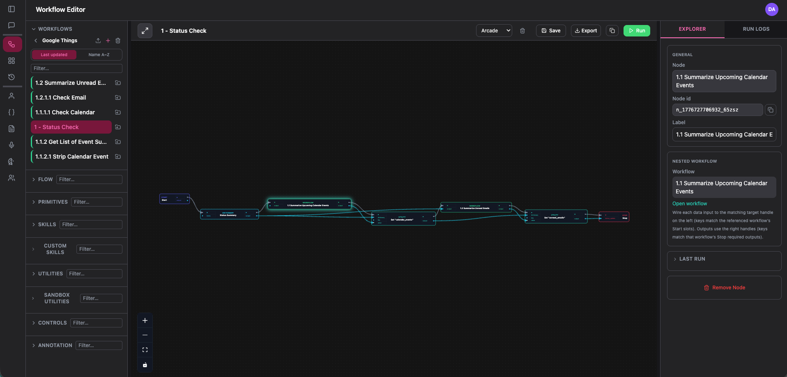
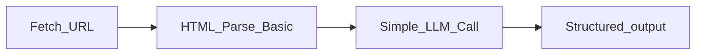

# Mind Weave

Mind Weave is a **visual workflow system** for composing **graph-based automations** that can include **local or self-hosted language models** together with ordinary data flow. You build on a canvas, run executions, and reuse subgraphs when you want the same behavior in more than one place. The default posture keeps model traffic on **infrastructure you control**—for example an OpenAI-compatible server such as **LM Studio** on your network.

Mind Weave is also **multimodal**: the same graph can combine text, structured data, images, audio, and other step outputs when your chosen palette nodes support them.

For a full tour of the product shell (Build, Workspace, Sandbox, Configure), see **[docs/MIND_WEAVE_ONE_PAGE.md](docs/MIND_WEAVE_ONE_PAGE.md)**.

<p align="center">
  
</p>
<p align="center"><em>Workflow Editor: build and run graph-based automations on the canvas.</em></p>

## What can I build?

- **Multimodal analysis pipelines** — Combine text, images, and tool outputs in one graph; route them through a local model or structured extraction.
- **Audio transcription plus reasoning** — Capture speech (or files), normalize text, and chain into downstream steps.
- **Browser-assisted extraction and parsing** — Pull page content or snapshots, then reshape and interpret it in the graph (see **[docs/OPERATIONS.md](docs/OPERATIONS.md)** for operational notes when optional capture dependencies apply).
- **Local LLM orchestration** — Run steps against **LM Studio** or another OpenAI-compatible endpoint without treating the cloud as the default execution path.
- **Structured information extraction** — Attach **Structures** (JSON Schema expectations) so model output lands as typed data, not only free text.
- **Nested reusable workflows** — Embed saved definitions as **Workflow** nodes or expose them as **Custom Skills** for composability.
- **AI-powered automation chains** — Branch on conditions, loop over lists, and handle failures with control-flow nodes.
- **Visual graph orchestration** — Express dependencies as wiring instead of ad hoc scripts.
- **Agent-like workflow systems** — Compose skills that call models, fetches, and tools in explicit order with inspectable steps.
- **Private / local processing** — Keep runs and artifacts on hosts and networks you operate.

Concrete outcomes include: *extract structured data from websites using capture and local reasoning*, *turn a transcript into a summarized document*, *chain fetch → parse → LLM → validated JSON* for downstream tools.

## Example composition

A common pattern is **fetch → reshape → model → persist**:

**Fetch URL** (Skill) → **HTML Parse Basic** (Utility) → **Simple LLM Call** (Skill) → optional **Structure** for JSON-shaped output → **Upsert Document** (Utility) for durable storage.



A scripted **fetch → parse** sample (no LLM) ships under **[docs/OPERATIONS.md — Debugging workflows](docs/OPERATIONS.md#debugging-workflows-graphs-and-runs)** (`run_books_toscrape_fetch_parse_sample.py`).

## Core mental model

- **Workflows** — Graphs of connected **nodes** with explicit data and control flow **edges**. Execution walks that graph according to your wiring and step kinds.
- **Skills** — Steps that **reach outward**: model calls, HTTP fetches, file or browser-backed capture, speech bridges, integrations. *They act on the world.*
- **Utilities** — Steps that **reshape, validate, or structure data** already inside the run: parsing, formatting, filtering, extraction, document helpers. *They reshape information.*
- **Personas** — Saved prompt and default-model presets that **shape how a model behaves** when a node references them.
- **Structures** — Optional **JSON Schema** contracts for **typed outputs** (for example when a skill should return entities or tables, not prose).

**Framing:** skills act on the world; utilities reshape information; workflows compose behavior. For contributor-oriented placement rules (including documented exceptions), see **[docs/NODE_TAXONOMY.md](docs/NODE_TAXONOMY.md)**. For full terminology depth, see **[docs/DOMAIN_MODEL.md](docs/DOMAIN_MODEL.md)**.

## Quick Start

**Prerequisites:** **`uv`** for Python, **Node.js** for the SPA, and a one-time install in each package. Full first-time setup (exact commands, optional extras, and troubleshooting) lives in **[docs/DEVELOPMENT.md](docs/DEVELOPMENT.md)**.

From the **repository root** after clone:

```bash
make dev
```

Equivalent: **`./startdev.sh`** (the Makefile delegates here).

The script prints the **frontend** and **API** base URLs. Open the **frontend URL** in your browser (often port **5173** in development). When both processes are up and the UI loads, you are ready. **`Ctrl+C`** stops the API and Vite together.

**Platforms:** Bash-first (**macOS** / **Linux**). **GNU make** ships on macOS; **Git Bash** or **WSL** against **`./startdev.sh`** is **best-effort** on Windows—report gaps if native shells need first-class support.

**Problems starting the stack?** **[docs/OPERATIONS.md — Local development troubleshooting](docs/OPERATIONS.md#local-development-troubleshooting)**.

## Your first workflow

Goal: a **short path** to a visible run on the canvas—no runtime deep dive required.

1. **Sign in** (or complete local bootstrap per **[backend/README.md](backend/README.md#important-notes-on-authentication)** if this is a fresh install).
2. Open **Workflows** and **create** a workflow (or open the starter) in the editor.
3. From the palette, add a **Utility** node like **HTML Parse Basic** and a **Skill** node like **Simple LLM Call**. Wire **Start** into the utility (or feed it sample text), then wire the utility’s output into the skill’s text input as your graph requires.
4. Configure the **Simple LLM Call** node with a prompt and ensure your **LM Studio** (or other OpenAI-compatible) endpoint is available to the API host.
5. Click **Run** and watch step outputs in the explorer / replay surfaces.

Use palette labels consistently while you learn—that trains the domain vocabulary without memorizing a separate glossary first.

## How it works under the hood

Mind Weave is a full-stack system: a **SPA** talks to an **API** that **persists** definitions and runs, **executes** graphs in the background, and **streams** build progress to the browser. DAG scheduling, concurrency, persistence formats, and streaming mechanics are **documented for contributors and operators**, not assumed at first contact.

**Read next:** **[docs/RUNTIME_ARCHITECTURE.md](docs/RUNTIME_ARCHITECTURE.md)** (runtime topology, execution flow, diagrams) and **[docs/ARCHITECTURE.md](docs/ARCHITECTURE.md)** (engineering single sources of truth and conventions).

## For contributors

Pull-request expectations and contributor orientation: **[CONTRIBUTING.md](CONTRIBUTING.md)**. Extending the palette (new skills, utilities, or controls) starts with **[docs/NODE_TAXONOMY.md](docs/NODE_TAXONOMY.md)** and **[docs/DEVELOPMENT.md](docs/DEVELOPMENT.md#adding-a-workflow-node)**.

## Documentation map

| Doc | Purpose |
|-----|---------|
| [docs/MIND_WEAVE_ONE_PAGE.md](docs/MIND_WEAVE_ONE_PAGE.md) | Product narrative and UI walkthrough |
| [docs/DOMAIN_MODEL.md](docs/DOMAIN_MODEL.md) | Terminology, node families, pointers to execution semantics |
| [docs/DEVELOPMENT.md](docs/DEVELOPMENT.md) | Local development, environment alignment, testing, adding nodes |
| [docs/RUNTIME_ARCHITECTURE.md](docs/RUNTIME_ARCHITECTURE.md) | Runtime topology, execution flow, diagrams |
| [docs/ARCHITECTURE.md](docs/ARCHITECTURE.md) | Engineering SSOT: layers, executor, palette contracts |
| [docs/OPERATIONS.md](docs/OPERATIONS.md) | Runbook, debugging, local dev troubleshooting |
| [docs/DEPLOYMENT_AND_NETWORK.md](docs/DEPLOYMENT_AND_NETWORK.md) | HTTPS, OAuth, LAN, nginx, tunnels |
| [backend/README.md](backend/README.md) | API, env, setup |
| [frontend/README.md](frontend/README.md) | SPA, Vite, LAN dev |

**Audits and quality:** [docs/Audits/DOCUMENTATION_AUDIT.md](docs/Audits/DOCUMENTATION_AUDIT.md), [docs/Audits/TEST_AUDIT.md](docs/Audits/TEST_AUDIT.md), [docs/Audits/PUBLIC_RELEASE_PASS.md](docs/Audits/PUBLIC_RELEASE_PASS.md), and sibling files under `docs/Audits/`.

## Testing and regression confidence

Backend pytest suites are extensive. **This project does not use a line-coverage target**; what matters is that important behavior is covered and recorded. **Line coverage is not the same as “core behavior covered.”** See [docs/Audits/TEST_AUDIT.md](docs/Audits/TEST_AUDIT.md) for the capability → test matrix and how to keep it current when the API changes. For README vs shipped-code drift and the documentation audit process, see [docs/Audits/DOCUMENTATION_AUDIT.md](docs/Audits/DOCUMENTATION_AUDIT.md).

## License, security, and contributing

Mind Weave is licensed under the [Apache License 2.0](LICENSE). To report security vulnerabilities privately, see [SECURITY.md](SECURITY.md) (GitHub **Security** tab — enable private vulnerability reporting on the repo if needed). For development setup and pull-request expectations, see [CONTRIBUTING.md](CONTRIBUTING.md).

## Releases and upgrades

See [CHANGELOG.md](CHANGELOG.md) for operator-facing release notes and [docs/OPERATIONS.md](docs/OPERATIONS.md) for deployment runbook detail (JWT upgrades, multi-instance rate limits).
