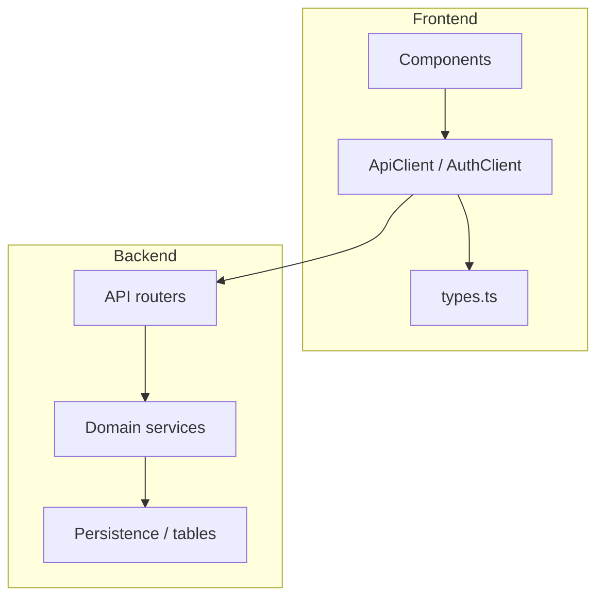

---

## last_reviewed: 2026-05-08 (CQ-013 and CQ-014 remediated — Ruff formatter + `mypy app`)
audience: Maintainers and contributors; periodic cohesion / style passes
scope: `backend/app/`, `frontend/src/`, root and package tooling that affects consistency (`pyproject.toml`, `frontend/package.json`). **Not** security behavior (see [SECURITY_AUDIT.md](SECURITY_AUDIT.md)) or test-to-behavior mapping (see [TEST_AUDIT.md](TEST_AUDIT.md)).
methodology: Static review of layered architecture, DRY, documentation habits, tooling, and “one obvious way” to solve common problems. **This backlog is built incrementally**—it does not assert that every line of the repo was reviewed in a single pass. New passes should add **CQ-xxx** rows, update `last_reviewed`, and **remove or archive rows** when remediated (same workflow as security findings: keep ids stable until closed).

**Severity legend**

| Level | Meaning |
|-------|---------|
| **Critical** | Likely wrong behavior, dangerous inconsistency, or blocker for safe change. |
| **High** | Maintainability or drift risk that will compound (duplication across layers, unmaintainable hotspots). |
| **Medium** | Inconsistent patterns, weaker UX for developers, or missing guardrails—not urgent but worth scheduling. |
| **Low** | Nits, cosmetic ordering, or small hygiene issues; batch with other work. |
| **Info** | Optional tooling or process recommendations. |

# Mind Weave — Code quality and style audit

## How to use this document

1. On each review pass, update `last_reviewed` in the front matter.
2. **Open findings** lists active work. When a row is fully addressed, **delete it** from the open table (or move to a short “Resolved” appendix if you prefer history—if so, record the date and PR).
3. New issues get the next free **CQ-xxx** id; existing ids stay stable until closed.
4. After cohesion-relevant refactors, update [CHANGELOG.md](../../CHANGELOG.md) if user-visible or operator-facing behavior changes; skim [TEST_AUDIT.md](TEST_AUDIT.md) for rows that need new proof.

## Executive summary

Mind Weave is structured in an understandable way: **FastAPI routers → domain services → SQLModel tables** on the backend, and **React components → API clients → shared types** on the frontend.

Prior passes addressed palette SSOT, workflow editor modularization, shared HTTP error parsing, ESLint, executor and **`schemas`** (Pydantic models; formerly a package named `types`, renamed to avoid stdlib shadowing with mypy), and [ARCHITECTURE.md](../ARCHITECTURE.md). **Low/Info follow-ups are done:** unused `@heroicons/react` removed; **`async def` vs `def`** documented (CRUD sync by default; `await` I/O stays async—see `models.py`); **`workflow_definitions` import order** cleaned; **scratch `test_pydantic.py` removed**; **Ruff** and **mypy** on `app/` in [`backend/pyproject.toml`](../../backend/pyproject.toml) with `uv run ruff …` / `uv run mypy app` ([backend README](../../backend/README.md)).

**This pass (2026-05-08)** re-validated layering with a breadth-first skim of backend top-level roots (`api/`, `core/`, `domain/`, `integrations/`, `persistence/`, `prompting/`, `providers/`, `cli/`) and frontend roots (`api/`, `components/`, `contexts/`, `domain/`, `sandbox/`, `theme/`). Routers sampled (including documents and transcription-related paths) remain thin; **`fetch`** is centralized in [`http.ts`](../../frontend/src/api/http.ts); ESLint **`npm run lint`** is clean; clipboard uses [`systemClipboard.ts`](../../frontend/src/systemClipboard.ts) per [DESIGN_SYSTEM.md](../DESIGN_SYSTEM.md). **CQ-013 (Ruff formatter)** is remediated: **`ruff format --check app tests`** passes. **CQ-014** is remediated: **`uv run mypy app`** passes (dev stubs include **`types-jsonschema`** — see **`backend/pyproject.toml`** **`[project.optional-dependencies] dev`**).

## System layers (cohesion target)

Single sources of truth should live at the **domain or shared contract** boundary (see [ARCHITECTURE.md](../ARCHITECTURE.md)).

## Open findings

No active CQ items.

**Next unused id:** **CQ-015**.

## Strengths (preserve these)

- **Router consistency:** Resource CRUD modules share the same structure, docstring route maps, and HTTP exception patterns ([`personas.py`](../../backend/app/api/v1/personas.py), [`structures.py`](../../backend/app/api/v1/structures.py), [`palettes.py`](../../backend/app/api/v1/palettes.py)).
- **Domain boundaries:** Business logic is largely **not** embedded in routers; services own queries and ownership rules ([`workflow_definition_service.py`](../../backend/app/domain/services/workflow_definition_service.py)).
- **Executor documentation:** [`workflow_executor/executor.py`](../../backend/app/domain/workflow_executor/executor.py) opens with a clear execution model (validation → topo sort → wave execution).
- **Central API surface (non-auth):** [`ApiClient`](../../frontend/src/api/client.ts) consolidates JSON resource calls; errors normalized via [`http.ts`](../../frontend/src/api/http.ts).
- **Frontend lint gate:** ESLint **`npm run lint`** (`--max-warnings 0`) passes repo-wide (`frontend`).
- **Mechanical Python consistency:** **`ruff check`**, **`ruff format --check`**, and **`mypy app`** pass for the configured backend gates (see **`backend/pyproject.toml`**).

## Related documents

- [MODULAR_DIRECTION_AUDIT.md](MODULAR_DIRECTION_AUDIT.md) — composable workflow “brick” model UI → domain → data alignment.
- [LIBRARY_USAGE_AUDIT.md](LIBRARY_USAGE_AUDIT.md) — dependency necessity, overlap, and stack fit.
- [SECURITY_AUDIT.md](SECURITY_AUDIT.md) — threats and controls.
- [TEST_AUDIT.md](TEST_AUDIT.md) — behavior ↔ test mapping; update when refactors touch invariants.
- [CHANGELOG.md](../../CHANGELOG.md) — user/operator-visible changes.
- [OPERATIONS.md](../OPERATIONS.md) — deployment posture.
- [ARCHITECTURE.md](../ARCHITECTURE.md) — layering and “one way” conventions.

## Review checklist (periodic)

- Bump `last_reviewed` and scan **Open findings**.
- After palette/node-type changes: verify backend `palette_defaults` + frontend `paletteDefaults` stay aligned.
- After large UI edits: consider Playwright/Cypress backlog per [TEST_AUDIT.md](TEST_AUDIT.md) (workflow editor E2E).
- If HTTP contract or error payload shape changes: update `http.ts` and [ARCHITECTURE.md](../ARCHITECTURE.md).
- Optionally run `uv run ruff format app tests` and `uv run mypy app` before large merges.
