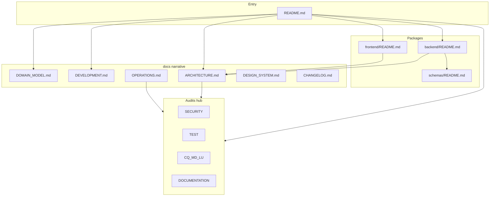

---

## last_reviewed: 2026-05-11 (README layering, DOMAIN_MODEL + DEVELOPMENT docs)
audience: Maintainers and operators validating that prose matches code and that docs are discoverable
scope: Root and package READMEs, `docs/*.md` (non-audit narrative), **`docs/DEVELOPMENT.md`**, **`docs/DOMAIN_MODEL.md`**, **`docs/DEPLOYMENT_AND_NETWORK.md`** (SSOT for network paths, Google OAuth, HTTPS/tunnel), **`docs/NODE_TAXONOMY.md`** (contributor taxonomy + placement), `backend/.env.example` comments, [`backend/app/domain/schemas/README.md`](../../backend/app/domain/schemas/README.md). **Not** re-auditing security behavior ([SECURITY_AUDIT.md](SECURITY_AUDIT.md)), dependencies ([LIBRARY_USAGE_AUDIT.md](LIBRARY_USAGE_AUDIT.md)), composition ([MODULAR_DIRECTION_AUDIT.md](MODULAR_DIRECTION_AUDIT.md)), code style ([CODE_QUALITY_AND_STYLE_AUDIT.md](CODE_QUALITY_AND_STYLE_AUDIT.md)), or test mapping ([TEST_AUDIT.md](TEST_AUDIT.md))—this file **points** to those.
methodology: Static inventory, relative-link sanity checks from `docs/` and repo root, SSOT/dup review, and sampled factual spot-checks against [`backend/app/domain/schemas/graph_nodes.py`](../../backend/app/domain/schemas/graph_nodes.py), [`backend/app/domain/palette_defaults.py`](../../backend/app/domain/palette_defaults.py), and [`frontend/src/components/workflow-editor/WorkflowEditor.tsx`](../../frontend/src/components/workflow-editor/WorkflowEditor.tsx). New passes add **DO-xxx** rows, update `last_reviewed`, and **remove** rows when remediated (keep ids stable until closed). **Documents:** treat [ARCHITECTURE.md](../ARCHITECTURE.md) “Resource-backed primitives” as the narrative SSOT—**`documents.body`** is flexible text (Markdown is common, not exclusive); keep [WORKFLOW_TOOL_INVENTORY.md](../../WORKFLOW_TOOL_INVENTORY.md) and package READMEs consistent.

**Severity legend**

| Level | Meaning |
|-------|---------|
| **Critical** | Wrong operator or security guidance; broken onboarding; misleading runbook. |
| **High** | Maintainer checklist wrong enough to cause bad migrations or API misuse. |
| **Medium** | Product/capability drift (README vs shipped node types/palette keys); contributors will miss steps. |
| **Low** | Discoverability gaps, incomplete enumeration in non-SSOT blurbs. |
| **Info** | Convention/hygiene (e.g. audit id prefix alignment) without blocking readers today. |

# Mind Weave — Documentation audit

## How to use this document

1. On each review pass, update `last_reviewed` in the front matter.
2. **Open findings** lists active **DO-xxx** work. When a row is fully addressed, **delete it** (or move to a short “Resolved” appendix with date/PR if you want history).
3. New issues get the next free **DO-xxx** id (continue past the highest id in **Open findings**). Existing ids stay stable until closed.
4. When documentation gaps reflect **behavior** changes, update [CHANGELOG.md](../../CHANGELOG.md) if user-visible; skim [TEST_AUDIT.md](TEST_AUDIT.md) if the gap implies missing test citations.

## Executive summary

Prose documentation is **coherent at the architecture level** ([ARCHITECTURE.md](../ARCHITECTURE.md) remains the right SSOT for layering and “adding a node type”). **`make dev`** (repo-root **`Makefile` → `./startdev.sh`**) documents the canonical local bootstrap with LAN-aware **`CORS_ORIGINS`**, **`FRONTEND_URL`**, **`TRUSTED_HOSTS`**, **`VITE_API_BASE`**. The root **[README.md](../../README.md)** stages onboarding (capabilities before setup); **[DEVELOPMENT.md](../DEVELOPMENT.md)** carries first-time install and contributor dev depth; **[DOMAIN_MODEL.md](../DOMAIN_MODEL.md)** carries reader-oriented vocabulary. **[NODE_TAXONOMY.md](../NODE_TAXONOMY.md)** anchors contributor placement guidance (verbs vs grammar + documented persistence exceptions). **[WORKFLOW_SKILLS.md](../WORKFLOW_SKILLS.md)** documents **`output.data` vs `details.skill_diagnostics`** for integration skills (calendar, Gmail). **[DESIGN_SYSTEM.md](../DESIGN_SYSTEM.md)** includes **Context help (info pop-outs)** for inspector affordances (e.g. Gmail search primer). **[DEPLOYMENT_AND_NETWORK.md](../DEPLOYMENT_AND_NETWORK.md)** is the SSOT for localhost vs LAN vs domain vs tunnel and Google OAuth (aligned with package READMEs). **High-level READMEs** ([root](../../README.md), [backend](../../backend/README.md), [frontend](../../frontend/README.md)) enumerate primitives (including **Boolean** / **Int**), palette keys (aligned with [`DEFAULT_PALETTE_COLORS`](../../backend/app/domain/palette_defaults.py)), utilities, controls (comparisons and And/Or/Xor), **Graph node** model names, and **Start** input types (`boolean` / `int`) consistent with [`graph_nodes.py`](../../backend/app/domain/schemas/graph_nodes.py) and the workflow editor. Security findings use the **`SE-xxx`** prefix (same scheme as **CQ** / **MD** / **LU** / **DO**); see [SECURITY_AUDIT.md](SECURITY_AUDIT.md). This audit is linked from [ARCHITECTURE.md](../ARCHITECTURE.md) **Related audits**, the [root README](../../README.md) (Testing section), and [OPERATIONS.md](../OPERATIONS.md) **Where to look**.

## Documentation map

## Documentation corpus (inventory)

| Document | Primary audience | Role |
|----------|------------------|------|
| [README.md](../../README.md) | New contributors / users | Staged onboarding (capabilities → composition → mental model → quick start **make dev** → first workflow); doc map; troubleshooting → [OPERATIONS.md](OPERATIONS.md) |
| [docs/DOMAIN_MODEL.md](../DOMAIN_MODEL.md) | Users / readers | Reader-oriented terminology; pointers to execution docs and [NODE_TAXONOMY.md](NODE_TAXONOMY.md) |
| [docs/DEVELOPMENT.md](../DEVELOPMENT.md) | Contributors | First-time install, LAN/env alignment, checks, adding workflow nodes |
| [docs/RUNTIME_ARCHITECTURE.md](../RUNTIME_ARCHITECTURE.md) | New contributors / users | Runtime topology, execution flow, Mermaid diagrams |
| [LICENSE](../../LICENSE) | Users / distributors | Apache-2.0 full text |
| [SECURITY.md](../../SECURITY.md) | Reporters / maintainers | Private vulnerability reporting via GitHub |
| [CONTRIBUTING.md](../../CONTRIBUTING.md) | Contributors | Dev setup (**`make dev`** first), manual/`uv` detail, checks, PR expectations |
| [Makefile](../../Makefile) / [`startdev.sh`](../../startdev.sh) | Contributors | Single FastAPI+Vite launcher; **`shellcheck startdev.sh`** hygiene expected after edits |
| [CHANGELOG.md](../../CHANGELOG.md) | Operators / upgraders | Release notes; points to OPERATIONS |
| [docs/NODE_TAXONOMY.md](../NODE_TAXONOMY.md) | Contributors | Palette families (**verbs vs grammar**), placement checklist, persisted-document utilities exception |
| [docs/ARCHITECTURE.md](../ARCHITECTURE.md) | Maintainers | Engineering SSOT: layering, SSOT pointers (includes taxonomy hub link), executor detail; links [RUNTIME_ARCHITECTURE.md](RUNTIME_ARCHITECTURE.md) for runtime map |
| [docs/OPERATIONS.md](../OPERATIONS.md) | Operators | Local dev troubleshooting, post-deploy auth, rate limits, doc pointers |
| [docs/DEPLOYMENT_AND_NETWORK.md](../DEPLOYMENT_AND_NETWORK.md) | Operators / self-hosters | SSOT: localhost vs LAN vs domain vs tunnel; Google OAuth; example nginx/env snippets |
| [docs/DESIGN_SYSTEM.md](../DESIGN_SYSTEM.md) | Frontend / UX | Palettes vs system theme tokens |
| [backend/README.md](../../backend/README.md) | Backend devs | Routers, concepts, env, how-tos |
| [frontend/README.md](../../frontend/README.md) | Frontend devs | Components, editor, node table |
| [backend/app/domain/schemas/README.md](../../backend/app/domain/schemas/README.md) | Backend devs | Import convention; rename note |
| [backend/.env.example](../../backend/.env.example) | Operators / devs | Env hints vs [config.py](../../backend/app/core/config.py) |
| [docs/Audits/PUBLIC_RELEASE_PASS.md](PUBLIC_RELEASE_PASS.md) | Maintainers | Pre-public checklist: scans, tests, git squash recipe, license/security follow-ups |
| [docs/Audits/*.md](.) | Maintainers | Focused audits (including this file) |

## Evidence from this pass

**Link hygiene (sampled):** From `docs/Audits/`, sibling links such as `../ARCHITECTURE.md` and `../../README.md` resolve. [`schemas/README.md`](../../backend/app/domain/schemas/README.md) uses `../../../../docs/ARCHITECTURE.md` (four levels up to repo root) — valid.

**Auth / operations alignment (sampled):** [CHANGELOG.md](../../CHANGELOG.md) **0.2.0** JWT claims, [OPERATIONS.md](../OPERATIONS.md) post-deploy auth, and [backend README](../../backend/README.md) User row describe **`typ` / `jti`** consistently.

**.env.example (sampled):** `OPEN_REGISTRATION`, `BOOTSTRAP_DEFAULT_ADMIN`, `SECRET_KEY` guidance matches the general posture described in backend README and security audit themes (not line-audited against every `Settings` field).

**Graph / palette spot-check:** [`GraphNode`](../../backend/app/domain/schemas/graph_nodes.py) includes **BooleanPrimitiveNode**, **IntPrimitiveNode**, **LenFromListUtilityNode**, **ListItemByIndexUtilityNode**, full **Gt/Lt/Gte/Lte/And/Or/Xor** controls, etc. [`DEFAULT_PALETTE_COLORS`](../../backend/app/domain/palette_defaults.py) lists matching palette keys. **This pass:** root [README.md](../../README.md) stages onboarding and detailed domain concepts live under [DOMAIN_MODEL.md](../DOMAIN_MODEL.md); keep the inventory rows aligned with those sources.

## Open findings

**No open findings.**

## Strengths (preserve these)

- **Clear SSOT for layering:** [ARCHITECTURE.md](../ARCHITECTURE.md) correctly centralizes palette/schema/executor pointers.
- **Strong package READMEs** for router layout, editor layout, and step add checklists.
- **Operator path** is short: CHANGELOG → OPERATIONS → backend README for env and auth; **network / OAuth** → DEPLOYMENT_AND_NETWORK.
- **`schemas` README** documents the `types` → `schemas` rename and stable imports.
- **Audit family** is consistent in structure (front matter, how-to-use, executive summary).

## Related documents

- [ARCHITECTURE.md](../ARCHITECTURE.md) — layering and single sources of truth.
- [DEPLOYMENT_AND_NETWORK.md](../DEPLOYMENT_AND_NETWORK.md) — network access, HTTPS, Google OAuth, tunnels.
- [OPERATIONS.md](../OPERATIONS.md) — deployment and JWT upgrade notes.
- [DESIGN_SYSTEM.md](../DESIGN_SYSTEM.md) — editor vs system colors.
- [CHANGELOG.md](../../CHANGELOG.md) — release-facing changes.
- [SECURITY_AUDIT.md](SECURITY_AUDIT.md) (finding ids **SE-xxx**), [TEST_AUDIT.md](TEST_AUDIT.md), [CODE_QUALITY_AND_STYLE_AUDIT.md](CODE_QUALITY_AND_STYLE_AUDIT.md), [MODULAR_DIRECTION_AUDIT.md](MODULAR_DIRECTION_AUDIT.md), [LIBRARY_USAGE_AUDIT.md](LIBRARY_USAGE_AUDIT.md) — sibling audits.

## Review checklist (periodic)

- Bump `last_reviewed` and triage **Open findings**.
- After new node types or palette keys: re-run README vs `palette_defaults.py` / `graph_nodes.py` / editor palettes.
- After auth or env changes: sample **CHANGELOG** ↔ **OPERATIONS** ↔ **backend README** alignment.
- When adding a new audit doc: update **Related audits** hubs and operator **Where to look** rows as needed.
