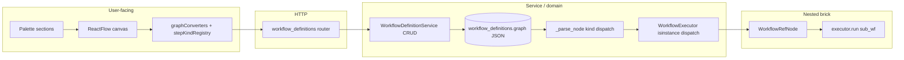

---

## last_reviewed: 2026-03-19 (Skills family: simple_llm_call as kind skill + skill_type; editor Skills palette; graph migration s0t1u2v3w4x5)
audience: Product-minded maintainers validating that composable “Lego brick” workflows are reflected in code end-to-end
scope: Workflow composition only: `frontend/src/components/workflow-editor/`, `frontend/src/domain/paletteDefaults.ts`, `frontend/src/api/types.ts` + `client.ts` (workflow paths); `backend/app/domain/schemas/graph_nodes.py`, `graph_io.py`, `workflow_executor/*`, `domain/services/workflow_definition_service.py`, `api/v1/workflow_definitions.py`, `persistence/tables.py` (`WorkflowDefinition`), and Alembic migrations that reshape stored graphs. **Not** generic style/DRY (see [CODE_QUALITY_AND_STYLE_AUDIT.md](CODE_QUALITY_AND_STYLE_AUDIT.md)), security ([SECURITY_AUDIT.md](SECURITY_AUDIT.md)), or dependency fit ([LIBRARY_USAGE_AUDIT.md](LIBRARY_USAGE_AUDIT.md)).
methodology: Static pass tracing **step kinds** (primitive / utility / skill / control / workflow reference, plus start/stop) from palette and canvas through API types and persisted `graph` JSON into **parse → dispatch → execute**. **This backlog is built incrementally**—new passes add **MD-xxx** rows, update `last_reviewed`, and **remove** rows when remediated (keep ids stable until closed).

**Severity legend**

| Level | Meaning |
|-------|---------|
| **Critical** | Product story broken: cannot nest workflows, kinds disagree across layers, or data shape blocks composition. |
| **High** | Adding a **new step kind** is undocumented or orderless across layers; high probability of shipping a half-wired brick. |
| **Medium** | Clear compositional model but **repeated dispatch** or **drift-prone mirrors** between UI and backend; extension works if checklist is followed. |
| **Low** | Naming or doc drift (`kind` vs palette label); small UX-for-maintainers gaps. |
| **Info** | Optional long-term alignment (registries, graph versioning) without blocking the model today. |

# Mind Weave — Modular direction audit

## How to use this document

1. On each review pass, update `last_reviewed` in the front matter.
2. **Open findings** lists active **MD-xxx** work. When a row is fully addressed, **delete it** (or move to a short “Resolved” appendix with date/PR if you want history).
3. New issues get the next free **MD-xxx** id; existing ids stay stable until closed.
4. After changing how graphs are stored or executed, update [ARCHITECTURE.md](../ARCHITECTURE.md) and [TEST_AUDIT.md](TEST_AUDIT.md) as appropriate; user-visible workflow behavior → [CHANGELOG.md](../../CHANGELOG.md).

## Executive summary

The product story—**typed steps** (Primitives, Skills, Utilities, Controls) plus **Start/Stop** and **referenced workflows as steps**—maps cleanly to a **`kind` + discriminator** contract in both the SPA and the backend: **Pydantic node models** in [`backend/app/domain/schemas/graph_nodes.py`](../../backend/app/domain/schemas/graph_nodes.py), **`_parse_node`** in [`backend/app/domain/workflow_executor/parsing.py`](../../backend/app/domain/workflow_executor/parsing.py), and **per-type handlers** in [`backend/app/domain/workflow_executor/executor.py`](../../backend/app/domain/workflow_executor/executor.py). Persisted definitions are a **JSON `graph`** (nodes, edges, optional **`schema_version`**) on [`WorkflowDefinition`](../../backend/app/persistence/tables.py); validation is intentionally **run-time** in the executor (see service docstring). **React Flow `Node.type`** strings for persisted steps are tied to the same discriminant list via [`shared/workflow_graph_step_kinds.json`](../../shared/workflow_graph_step_kinds.json), [`stepKindRegistry.ts`](../../frontend/src/components/workflow-editor/stepKindRegistry.ts), and **parity tests** (`test_workflow_graph_step_kinds_parity.py`, `workflowGraphStepKindsManifest.test.ts`). Remaining **client-only** wiring (`getSourceOutputType`, connection rules, palette drops in [`WorkflowEditor.tsx`](../../frontend/src/components/workflow-editor/WorkflowEditor.tsx)) still must be updated when adding bricks—see [ARCHITECTURE.md](../ARCHITECTURE.md).

## Composable system map

## Layer 1 — User-touching (outward)

**Evidence reviewed:** [`WorkflowEditor.tsx`](../../frontend/src/components/workflow-editor/WorkflowEditor.tsx) (layout, collapsible **Workflows / Primitives / Skills / Utilities / Controls** palettes, nested-workflow enrichment for edges), [`nodeTypes.tsx`](../../frontend/src/components/workflow-editor/nodeTypes.tsx), [`graphConverters.ts`](../../frontend/src/components/workflow-editor/graphConverters.ts), [`stepKindRegistry.ts`](../../frontend/src/components/workflow-editor/stepKindRegistry.ts), [`shared/workflow_graph_step_kinds.json`](../../shared/workflow_graph_step_kinds.json), [`paletteDefaults.ts`](../../frontend/src/domain/paletteDefaults.ts), [`frontend/src/api/types.ts`](../../frontend/src/api/types.ts) (`GraphNode` variants, `WorkflowGraph`).

### Checklist answers

| Question | Finding |
|----------|---------|
| Are categories (primitive / utility / skill / control / workflow) obvious in UI and types? | **Yes.** Left panel separates **Primitives**, **Skills**, **Utilities**, **Controls**; referenced workflows appear as draggable **workflow** bricks. TS types mirror `kind` and `*_type` discriminators. |
| Is adding a category a bounded set of files? | **Partially.** A new **family** of steps follows [ARCHITECTURE.md](../ARCHITECTURE.md) (schemas, manifest, executor, palette, editor). Persisted **discriminant → React Flow type** is centralized in **`workflow_graph_step_kinds.json`** + **`stepKindRegistry`** + **`appNodeToFlow`**; **`getSourceOutputType`**, **connection rules**, and **palette rows** in **`WorkflowEditor`** still need manual updates per brick. |
| UI-only concepts vs API? | **Editor-only metadata:** e.g. `subWorkflowRequiredOutputs` / `subWorkflowRequiredInputs` on React Flow nodes for **edge coloring** and UX are **derived** from loaded sub-workflow definitions, not stored in `graph` JSON—appropriate since the contract is `workflow_id` + parent edges. Legacy **`response` utility nodes** are stripped on open ( compatibility). |

## Layer 2 — Service / domain

**Evidence reviewed:** [`workflow_definitions.py`](../../backend/app/api/v1/workflow_definitions.py) (thin CRUD + run), [`workflow_definition_service.py`](../../backend/app/domain/services/workflow_definition_service.py), [`graph_nodes.py`](../../backend/app/domain/schemas/graph_nodes.py), [`parsing.py`](../../backend/app/domain/workflow_executor/parsing.py), [`executor.py`](../../backend/app/domain/workflow_executor/executor.py) (including `_resolve_workflow_node`), [`graph.py`](../../backend/app/domain/workflow_executor/graph.py) (topo / wave execution—executor module layout).

### Checklist answers

| Question | Finding |
|----------|---------|
| Single extension checklist? | **Yes.** [ARCHITECTURE.md](../ARCHITECTURE.md) lists schemas → executor parsing/execution → palette defaults (backend + frontend) → frontend editor → tests. |
| Nested workflow reuses same primitives as top-level? | **Yes.** [`_resolve_workflow_node`](../../backend/app/domain/workflow_executor/executor.py) loads the sub-definition via `WorkflowDefinitionService`, builds overrides from parent edges, then **`WorkflowExecutor(...).run(sub_wf, ..., execution_stack=...)`** with **cycle and self-reference** guards—same execution path as a root run. |
| Duplicated graph logic FE vs BE? | **Split:** persisted **`kind` + discriminator** are shared SSOT in **`workflow_graph_step_kinds.json`** with parse + converter parity tests; **edge/palette interaction** logic remains on the client alongside **`getSourceOutputType`**. |

### Sub-workflow trace (names)

- **Schema:** [`WorkflowRefNode`](../../backend/app/domain/schemas/graph_nodes.py) — `kind: "workflow"`, `data.workflow_id`.
- **Parse:** `kind == "workflow"` → `WorkflowRefNode` in [`parsing.py`](../../backend/app/domain/workflow_executor/parsing.py).
- **Execute:** `isinstance(..., WorkflowRefNode)` → [`_resolve_workflow_node`](../../backend/app/domain/workflow_executor/executor.py).

## Layer 3 — Data layer

**Evidence reviewed:** [`WorkflowDefinition.graph`](../../backend/app/persistence/tables.py) (`{"nodes": [], "edges": []}`), ownership via `user_id`, [`WorkflowDefinitionService`](../../backend/app/domain/services/workflow_definition_service.py) (opaque JSON, validation at run); sample migration [`c3d4e5f6a7b8_remove_response_utility_nodes.py`](../../backend/alembic/versions/c3d4e5f6a7b8_remove_response_utility_nodes.py) (product evolution of step types in stored graphs).

### Checklist answers

| Question | Finding |
|----------|---------|
| Stored JSON versioned / migratable? | **`schema_version`** (default **1** on write when absent) is stored on `graph`; executor still uses **tolerant parsing** of `nodes`/`edges`, **warnings** for unknown nodes, and **Alembic** when removing kinds. |
| Ownership / lifecycle for “definition as brick”? | **Yes, and simple:** CRUD scoped by user; `graph` holds compositional content only (plus node `position` for editor layout—reasonable coupling). |

## Open findings

None at this time.

## Strengths (preserve these)

- **Discriminated `kind` model** end-to-end: matches the Lego story (stack different brick families with a clear type key).
- **Single graph contract:** nodes + edges in the API mirror what the executor consumes; no alternate “shadow” semantics in the DB layer.
- **Nested workflows as first-class:** [`WorkflowRefNode`](../../backend/app/domain/schemas/graph_nodes.py) + stack-aware [`_resolve_workflow_node`](../../backend/app/domain/workflow_executor/executor.py) align product and runtime.
- **Palette SSOT** for colors: [`palette_defaults.py`](../../backend/app/domain/palette_defaults.py) and [`paletteDefaults.ts`](../../frontend/src/domain/paletteDefaults.ts) with explicit sync note—supports consistent visual language per brick type.
- **Executor entry narrative:** validation → topo/wave execution is documented at the top of [`executor.py`](../../backend/app/domain/workflow_executor/executor.py)—matches “compose then run” thinking.
- **Thin routers / service ownership:** [`workflow_definitions.py`](../../backend/app/api/v1/workflow_definitions.py) delegates to `WorkflowDefinitionService` and `WorkflowExecutor`—composition rules stay in domain code.
- **Step kind manifest + parity tests:** [`shared/workflow_graph_step_kinds.json`](../../shared/workflow_graph_step_kinds.json) lists every persisted variant; backend and frontend tests fail if **`_parse_node`** or **`appNodeToFlow` / `nodeTypes`** drift from that list.

## Related documents

- [ARCHITECTURE.md](../ARCHITECTURE.md) — layering and **Adding a workflow node type**.
- [CODE_QUALITY_AND_STYLE_AUDIT.md](CODE_QUALITY_AND_STYLE_AUDIT.md) — generic cohesion; overlap only where modular direction and DRY intersect (e.g. dispatch duplication).
- [TEST_AUDIT.md](TEST_AUDIT.md) — workflow executor and API tests; keep in sync when compositional behavior changes.
- [CHANGELOG.md](../../CHANGELOG.md) — user-visible workflow/editor changes.
- [OPERATIONS.md](../OPERATIONS.md) — deployment posture.

## Review checklist (periodic)

- Bump `last_reviewed` and triage **Open findings**.
- After adding a **step kind** or **palette category:** verify [ARCHITECTURE.md](../ARCHITECTURE.md) checklist; extend **`workflow_graph_step_kinds.json`** and re-run parity tests; touch `parsing`, `executor`, **`stepKindRegistry` / `graphConverters`**, **`nodeTypes`**, editor palette, and **`getSourceOutputType`** as needed.
- After changing **sub-workflow** behavior: confirm `WorkflowRefNode` path tests in `test_workflow_executor.py` still map to product expectations ([TEST_AUDIT.md](TEST_AUDIT.md)).
- After **migrations** that rewrite `graph.nodes`: add a one-line note here or in ARCHITECTURE if the compositional contract changes.
