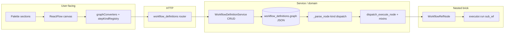

---

## last_reviewed: 2026-05-09 (**MD-001**, **MD-002**, **MD-003** closed: ARCHITECTURE + Vitest `getSourceOutputType`; executor dispatch + resolver/skills mixins + README; Workspace graph augmentation docs)
audience: Product-minded maintainers validating that composable “Lego brick” workflows are reflected in code end-to-end
scope: Workflow composition only: `frontend/src/components/workflow-editor/`, `frontend/src/domain/paletteDefaults.ts`, `frontend/src/api/types.ts` + `client.ts` (workflow paths); `backend/app/domain/schemas/graph_nodes.py`, `graph_io.py`, `workflow_executor/*`, `domain/services/workflow_definition_service.py`, `domain/workspace/workspace_google_graph.py` (**run-time graph copy** for Workspace default Google connection on Gmail/Calendar skills), `api/v1/workflow_definitions.py`, `persistence/tables.py` (`WorkflowDefinition`), and Alembic migrations that reshape stored graphs. **Not** generic style/DRY (see [CODE_QUALITY_AND_STYLE_AUDIT.md](CODE_QUALITY_AND_STYLE_AUDIT.md)), security ([SECURITY_AUDIT.md](SECURITY_AUDIT.md)), or dependency fit ([LIBRARY_USAGE_AUDIT.md](LIBRARY_USAGE_AUDIT.md)).
methodology: Static pass tracing **step kinds** (primitive / utility / skill / control / workflow reference, plus start/stop) from palette and canvas through API types and persisted `graph` JSON into **parse → dispatch → execute**. **This backlog is built incrementally**—new passes add **MD-xxx** rows, update `last_reviewed`, and **remove** rows when remediated (keep ids stable until closed).

**Severity legend**

| Level | Meaning |
|-------|---------|
| **Critical** | Product story broken: cannot nest workflows, kinds disagree across layers, or data shape blocks composition. |
| **High** | Adding a **new step kind** is undocumented or orderless across layers; high probability of shipping a half-wired brick. |
| **Medium** | Clear compositional model but **repeated dispatch** or **drift-prone mirrors** between UI and backend; extension works if checklist is followed. |
| **Low** | Naming or doc drift (`kind` vs palette label); small UX-for-maintainers gaps. |
| **Info** | Optional long-term alignment (registries, graph versioning) without blocking the model today. |

# Mind Weave — Modular direction audit

## How to use this document

1. On each review pass, update `last_reviewed` in the front matter.
2. **Open findings** lists active **MD-xxx** work. When a row is fully addressed, **delete it** (or move to a short “Resolved” appendix with date/PR if you want history).
3. New issues get the next free **MD-xxx** id; existing ids stay stable until closed.
4. After changing how graphs are stored or executed, update [ARCHITECTURE.md](../ARCHITECTURE.md) and [TEST_AUDIT.md](TEST_AUDIT.md) as appropriate; user-visible workflow behavior → [CHANGELOG.md](../../CHANGELOG.md).

## Executive summary

The product story—**typed steps** (Primitives, Skills, Utilities, Controls) plus **Start/Stop** and **referenced workflows as steps**—maps cleanly to a **`kind` + discriminator** contract in both the SPA and the backend: **Pydantic node models** in [`backend/app/domain/schemas/graph_nodes.py`](../../backend/app/domain/schemas/graph_nodes.py), **`_parse_node`** in [`backend/app/domain/workflow_executor/parsing.py`](../../backend/app/domain/workflow_executor/parsing.py), and execution routing via [`dispatch/execute_node_dispatch.py`](../../backend/app/domain/workflow_executor/dispatch/execute_node_dispatch.py) plus mixins ([`executor_resolver_mixin.py`](../../backend/app/domain/workflow_executor/executor_resolver_mixin.py), [`skills_runner_mixin.py`](../../backend/app/domain/workflow_executor/skills_runner_mixin.py)) anchored by [`executor.py`](../../backend/app/domain/workflow_executor/executor.py), with **focused helpers** in sibling modules (`fetch_url_runtime`, `capture_url_snapshot_runtime`, `multimodal_llm_runtime`, `html_parse_basic`, `gmail_llm_prompt`, `schema_normalizer`, `diagnostics`). See [`workflow_executor/README.md`](../../backend/app/domain/workflow_executor/README.md). Persisted definitions are a **JSON `graph`** (nodes, edges, optional **`schema_version`**, optional **`sandbox_defaults`**) on [`WorkflowDefinition`](../../backend/app/persistence/tables.py); validation is intentionally **run-time** in the executor (see service docstring). Before scheduling, **`WorkflowExecutor`** may apply a **deep-copied augmentation** via [`workflow_graph_with_default_google_connection`](../../backend/app/domain/workspace/workspace_google_graph.py) for Workspace runs (default Google connection onto Gmail/Calendar list skills)—the **persisted row** stays canonical; augmentation is intentional and covered by workspace/executor tests. **React Flow `Node.type`** strings tie to discriminants via [`shared/workflow_graph_step_kinds.json`](../../shared/workflow_graph_step_kinds.json), [`stepKindRegistry.ts`](../../frontend/src/components/workflow-editor/stepKindRegistry.ts), backend parity (**`test_workflow_graph_step_kinds_parity.py`**), and [`workflowGraphStepKindsManifest.test.ts`](../../frontend/src/components/workflow-editor/workflowGraphStepKindsManifest.test.ts) (including **`getSourceOutputType`** default-handle assertions). Remaining manual SPA wiring: **`appEdgeToFlow`** default **`target_handle`** branching, **`workflowConnectionRules.ts`**, and explorer/palette hookups in **`WorkflowEditor.tsx`** (per [ARCHITECTURE.md § Adding a workflow node type](../ARCHITECTURE.md)).

## Composable system map

## Layer 1 — User-touching (outward)

**Evidence reviewed:** [`WorkflowEditor.tsx`](../../frontend/src/components/workflow-editor/WorkflowEditor.tsx) (**Workflows / Primitives / Skills / Utilities / Controls** palettes, nested-workflow enrichment, palette drops); [`workflowConnectionRules.ts`](../../frontend/src/components/workflow-editor/workflowConnectionRules.ts); [`nodeTypes.tsx`](../../frontend/src/components/workflow-editor/nodeTypes.tsx); [`graphConverters.ts`](../../frontend/src/components/workflow-editor/graphConverters.ts) (`hoistStepDiscriminatorsFromData`, `appNodeToFlow`, `getSourceOutputType`, `appEdgeToFlow`); [`stepKindRegistry.ts`](../../frontend/src/components/workflow-editor/stepKindRegistry.ts); [`shared/workflow_graph_step_kinds.json`](../../shared/workflow_graph_step_kinds.json); [`paletteDefaults.ts`](../../frontend/src/domain/paletteDefaults.ts); [`workflowGraphStepKindsManifest.test.ts`](../../frontend/src/components/workflow-editor/workflowGraphStepKindsManifest.test.ts); [`frontend/src/api/types.ts`](../../frontend/src/api/types.ts) (`GraphNode`, `WorkflowGraph`).

### Checklist answers

| Question | Finding |
|----------|---------|
| Are categories (primitive / utility / skill / control / workflow) obvious in UI and types? | **Yes.** The Build UI groups **Primitives**, **Skills**, **Utilities**, **Controls**; workflows and **custom skills** (exposed definitions) appear under **Workflows** / **Custom Skills** per [`ARCHITECTURE.md` § Custom Skills](../ARCHITECTURE.md). [`types.ts`](../../frontend/src/api/types.ts) exposes discriminated **`GraphNode`** variants aligned with persisted JSON. |
| Is adding a category a bounded set of files? | **Partially — improved for shape and SPA typing signal, brittle for semantics.** Persisted **`kind`/discriminator → React Flow type** stays centralized (**[`workflow_graph_step_kinds.json`](../../shared/workflow_graph_step_kinds.json)** + **`stepKindRegistry`** + **`appNodeToFlow`**) and is guarded by **`workflowGraphStepKindsManifest.test.ts`** (manifest round-trip + **`getSourceOutputType`** default-handle sweep with an explicit `any` allowlist) + backend parity. **`getSourceOutputType`** / **`appEdgeToFlow`** implicit-handle branches and **`workflowConnectionRules`** remain manual per brick; **`WorkflowEditor`** registrations still need review when adding nodes. |
| UI-only concepts vs API? | **Mostly intentional split.** **`kind: "annotation"`** (note / region) is canvas-only — registered in **`stepKindRegistry`**’s annotation map, **absent from manifest**, skipped in **`parsing`** (no executor footprint), per ARCHITECTURE. React Flow **`invalidStep`** surfaces hoisted discriminators failures without mapping to Stop. **`subWorkflowRequiredOutputs` / `subWorkflowRequiredInputs`** on **`workflowRef`** nodes are derived for edge UX when child definitions load (not authored in stored `graph`). Legacy **`response` utility nodes** stripped on load remains a compatibility shim. Custom-skill **`data.label`** is the authored second-line label versus live definition name (`ARCHITECTURE`). |

## Layer 2 — Service / domain

**Evidence reviewed:** [`workflow_definitions.py`](../../backend/app/api/v1/workflow_definitions.py); [`workflow_definition_service.py`](../../backend/app/domain/services/workflow_definition_service.py); [`graph_nodes.py`](../../backend/app/domain/schemas/graph_nodes.py); [`graph_io.py`](../../backend/app/domain/schemas/graph_io.py); [`parsing.py`](../../backend/app/domain/workflow_executor/parsing.py); [`executor.py`](../../backend/app/domain/workflow_executor/executor.py); [`dispatch/execute_node_dispatch.py`](../../backend/app/domain/workflow_executor/dispatch/execute_node_dispatch.py); [`executor_resolver_mixin.py`](../../backend/app/domain/workflow_executor/executor_resolver_mixin.py); [`skills_runner_mixin.py`](../../backend/app/domain/workflow_executor/skills_runner_mixin.py); [`graph.py`](../../backend/app/domain/workflow_executor/graph.py); helper modules **`fetch_url_runtime`**, **`capture_url_snapshot_runtime`**, **`html_parse_basic`**, **`multimodal_llm_runtime`**, **`gmail_llm_prompt`**, **`schema_normalizer`**, **`diagnostics`**; [`workspace_google_graph.py`](../../backend/app/domain/workspace/workspace_google_graph.py) (Workspace default Google connection injection — called from **`WorkflowExecutor`** scheduling path); **`inputs.py`** sampled for downstream typing; **`test_workflow_graph_step_kinds_parity.py`** (green **2026-05-08**); package map [`workflow_executor/README.md`](../../backend/app/domain/workflow_executor/README.md).

### Checklist answers

| Question | Finding |
|----------|---------|
| Single extension checklist? | **Yes.** [ARCHITECTURE.md § Adding a workflow node type](../ARCHITECTURE.md) stays the authoritative ordered list (schemas → parse/execute → manifest → palettes backend+SPA → **`types` / converters / registry / nodes / palettes** → tests). New skills often also touch **`inputs.py`**, provider modules, Output Explorer conventions ([`OUTPUT_EXPLORER_UI.md`](../OUTPUT_EXPLORER_UI.md), [`WORKFLOW_SKILLS.md`](../WORKFLOW_SKILLS.md)). |
| Nested workflow reuses same primitives as top-level? | **Yes.** [`_resolve_workflow_node`](../../backend/app/domain/workflow_executor/executor_resolver_mixin.py) loads the child definition (`WorkflowDefinitionService`), maps parent-edge overrides, invokes **`WorkflowExecutor(...).run(sub_wf, …, execution_stack=…)`**, with **cycle** and **self-reference** safeguards — identical runtime model to a root workflow. |
| Duplicated graph logic FE vs BE? | **Structured split.** **FE/BE parity** for **persisted discriminants ↔ React Flow `type` ↔ pydantic parse** holds via manifest + **`test_workflow_graph_step_kinds_parity.py`** + **`workflowGraphStepKindsManifest.test.ts`**. **SPA:** **`getSourceOutputType`** default-handle behavior is regression-tested per manifest `react_flow_type` (explicit `any` allowlist); **`appEdgeToFlow`**, **`workflowConnectionRules`**, and **`WorkflowEditor`** wiring stay manual. **Backend-only:** **`workflow_graph_with_default_google_connection`** rewrites Gmail/Calendar list skill **`google_connection_id`** on a **`deepcopy`** for Workspace-capability execution — document in [ARCHITECTURE.md § Stored workflow graph](../ARCHITECTURE.md) (**Runtime graph augmentation**). **Executor package surface:** **`WorkflowExecutor`** public import stabilizer at [`workflow_executor.py`](../../backend/app/domain/services/workflow_executor.py) (thin re-export only). **`simple_llm_call` legacy coerce:** **`utility`** rows in old graphs still coerce to **`SimpleLLMCallSkillNode`** (`parsing` + **`stepKindRegistry.expectedReactFlowTypeForAppNode`**) alongside dedicated parity test **`test_legacy_utility_simple_llm_call_parses_as_skill_node`**. |

### Sub-workflow trace (names)

- **Schema:** [`WorkflowRefNode`](../../backend/app/domain/schemas/graph_nodes.py) — `kind: "workflow"`, `data.workflow_id`.
- **Parse:** `kind == "workflow"` → `WorkflowRefNode` in [`parsing.py`](../../backend/app/domain/workflow_executor/parsing.py).
- **Execute:** `isinstance(..., WorkflowRefNode)` → [`dispatch_execute_node`](../../backend/app/domain/workflow_executor/dispatch/execute_node_dispatch.py) → [`_resolve_workflow_node`](../../backend/app/domain/workflow_executor/executor_resolver_mixin.py).

## Layer 3 — Data layer

**Evidence reviewed:** [`WorkflowDefinition.graph`](../../backend/app/persistence/tables.py); [`WorkflowDefinitionService`](../../backend/app/domain/services/workflow_definition_service.py) (`schema_version` write path, opaque **`graph`** JSON); illustrative migration **`c3d4e5f6a7b8_remove_response_utility_nodes`**; **`sandbox_defaults`** / extra envelope keys referenced in [`ARCHITECTURE.md`](../ARCHITECTURE.md) (**graph** semantics).

### Checklist answers

| Question | Finding |
|----------|---------|
| Stored JSON versioned / migratable? | **`schema_version`** is persisted (service writes **1** when missing on save). Executor tolerates graphs with **`nodes`** / **`edges`** only (`ARCHITECTURE`); extra top-level keys (e.g. **`sandbox_defaults`**) survive round-trip storage but remain **orthogonal to brick dispatch** unless a feature reads them. Unknown executable nodes yield **warnings** at parse time; removals use **Alembic** migrations (e.g. legacy **`response`** utility strip). |
| Ownership / lifecycle for “definition as brick”? | **Yes.** **`WorkflowDefinition`** rows are **`user_id`‑scoped**; canonical composition lives in **`graph`** JSON (**nodes**, **edges**, layout **`position`**). **`expose_as_custom_skill`** is a lifecycle flag pairing with **`WorkflowRefNode`** authoring (`ARCHITECTURE` § Custom Skills). |

## Open findings

_No active MD-xxx rows._ After compositional edits, run **`uv run pytest tests/test_workflow_graph_step_kinds_parity.py`** from **`backend/`** and **`npm test -- --run src/components/workflow-editor/workflowGraphStepKindsManifest.test.ts`** from **`frontend/`**.

**Next unused id:** **MD-004**.

## Strengths (preserve these)

- **Discriminated `kind` model** end-to-end: matches the Lego story (stack different brick families with a clear type key).
- **Canonical at-rest graph contract:** Stored **`nodes`** + **`edges`** match API/exchange payloads; **`WorkflowExecutor`** may **`deepcopy` + augment** for Workspace defaults (`workspace_google_graph`) before parse — **persisted rows are not mutated in place** ([ARCHITECTURE.md § Stored workflow graph — Runtime graph augmentation](../ARCHITECTURE.md)).
- **Nested workflows as first-class:** [`WorkflowRefNode`](../../backend/app/domain/schemas/graph_nodes.py) + stack-aware [`_resolve_workflow_node`](../../backend/app/domain/workflow_executor/executor_resolver_mixin.py) align product and runtime.
- **Palette SSOT** for colors: [`palette_defaults.py`](../../backend/app/domain/palette_defaults.py) and [`paletteDefaults.ts`](../../frontend/src/domain/paletteDefaults.ts) with explicit sync note—supports consistent visual language per brick type.
- **Executor entry narrative:** validation → topo/wave execution is documented at the top of [`executor.py`](../../backend/app/domain/workflow_executor/executor.py) — see also [`workflow_executor/README.md`](../../backend/app/domain/workflow_executor/README.md) for the routing map.
- **Focused skill-runtime modules** (`capture_url_snapshot_runtime`, `fetch_url_runtime`, `multimodal_llm_runtime`, `html_parse_basic`, `gmail_llm_prompt`) plus **dispatch (`dispatch/execute_node_dispatch.py`)** and **mixins** (`executor_resolver_mixin`, `skills_runner_mixin`) partition the executor without changing the public **`WorkflowExecutor`** API.
- **Thin routers / service ownership:** [`workflow_definitions.py`](../../backend/app/api/v1/workflow_definitions.py) delegates to `WorkflowDefinitionService` and `WorkflowExecutor`—composition rules stay in domain code.
- **Step kind manifest + parity tests:** [`shared/workflow_graph_step_kinds.json`](../../shared/workflow_graph_step_kinds.json) lists every persisted variant; backend and frontend tests fail if **`_parse_node`** or **`appNodeToFlow` / `nodeTypes`** drift from that list.

## Related documents

- [ARCHITECTURE.md](../ARCHITECTURE.md) — layering and **Adding a workflow node type**.
- [CODE_QUALITY_AND_STYLE_AUDIT.md](CODE_QUALITY_AND_STYLE_AUDIT.md) — generic cohesion; overlap only where modular direction and DRY intersect (e.g. dispatch duplication).
- [TEST_AUDIT.md](TEST_AUDIT.md) — workflow executor and API tests; keep in sync when compositional behavior changes.
- [CHANGELOG.md](../../CHANGELOG.md) — user-visible workflow/editor changes.
- [OPERATIONS.md](../OPERATIONS.md) — deployment posture.

## Review checklist (periodic)

- Bump `last_reviewed` and triage **Open findings**.
- After adding a **step kind** or **palette category:** verify [ARCHITECTURE.md](../ARCHITECTURE.md) checklist; extend **`workflow_graph_step_kinds.json`** and **re-run both parity suites** (`Open findings` commands); touch `parsing`, `executor` (+ satellites as needed), **`stepKindRegistry` / `graphConverters`**, **`nodeTypes`**, editor palette rows, **`getSourceOutputType`** / **`appEdgeToFlow`**, **`workflowConnectionRules`**, and **`palette_defaults.py`** + **`paletteDefaults.ts`** for new handle keys (`MD-001`).
- After changing **`workflow_graph_with_default_google_connection`** (Workspace default Google wiring for Gmail / Calendar-list skills): re-run **`test_workspace_google_graph`**, **`test_workflow_executor_nested_google`** ([`TEST_AUDIT.md`](TEST_AUDIT.md)); see **ARCHITECTURE.md** (**Runtime graph augmentation**).
- After changing **sub-workflow** behavior: confirm `WorkflowRefNode` path tests in `test_workflow_executor.py` still map to product expectations ([TEST_AUDIT.md](TEST_AUDIT.md)).
- After **migrations** that rewrite `graph.nodes`: add a one-line note here or in ARCHITECTURE if the compositional contract changes.
