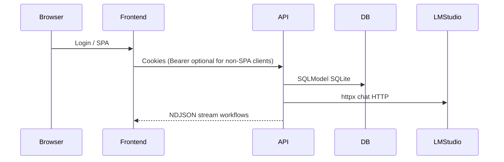

---

## last_reviewed: 2026-05-08 (public-release dependency pass; pip-audit / npm audit)
audience: Pre-public / self-hosted hardening; periodic review
scope: backend/, frontend/, root `.gitignore`, backend config and env examples
methodology: OWASP-style static review (auth, OAuth, IDOR, inputs, browser, LLM/availability, headers, secrets); `uvx pip-audit` / `npm audit`; regression tests. For **which behavior is tested**, see [TEST_AUDIT.md](TEST_AUDIT.md).

**Threat model (this pass):** Primary adversaries are **authenticated users** (multi-account on one deployment), **LAN attackers** reaching the API, and **misconfigured** TLS/CORS/Google redirects. Single-tenant self-hosted deployments with one trusted operator have proportionally lower exposure; controls below still apply.

# Mind Weave — Security audit

## How to use this document

1. On each review, update `last_reviewed` at the top.
2. **Open findings** below lists only residual or unmitigated work. When a row is fully addressed, **delete it**. When nothing is left, **remove the table** and keep a single line: **No open findings.**
3. New issues discovered in a pass get the next free **SE-xxx** id (continue past **SE-034**; next unused id is **SE-035**). Existing ids in the table below are stable until closed.
4. After security-relevant changes, run `uv run pytest` from `backend/` (optional `--cov=app` for a report only). For a recorded pre-public checklist, see [PUBLIC_RELEASE_PASS.md](PUBLIC_RELEASE_PASS.md).

## Executive summary

Mind Weave is a **single-tenant / self-hosted** style app: HttpOnly cookie sessions (optional Bearer), SQLite by default, LM Studio for inference, optional Google OAuth.

**Controls in place** (high level): strict `SECRET_KEY` / bootstrap rules outside `local`; DB-backed OAuth state; Google session codes in URL fragment then exchanged for HttpOnly cookies; **refresh JWT `jti` rotation with server-side revocation** (refresh tokens **without `jti` are rejected**); access JWTs must declare **`typ=access`**; narrow CORS; trusted hosts + security headers + optional HSTS; **auth**, **workflow sync run** (**`POST …/run`**), **workflow enqueue** (**`POST …/runs`**), and related routes — in-process **per-IP rate limits** with **`N/minute` validation at Settings load** ([`backend/app/core/auth_rate_limit.py`](../../backend/app/core/auth_rate_limit.py), [`backend/app/core/config.py`](../../backend/app/core/config.py)); closable registration; password policy; **allowlisted** user `settings` / `api_keys` with **Fernet encryption for stored API key strings**; **Google workflow OAuth refresh tokens** encrypted at rest (`encrypt_sensitive_at_rest`, same key material as API keys); masked `api_keys` on `/me`; authenticated model listing; split health endpoints; OpenAPI only in `local`; **run logs redacted at rest and on read** (including **URL stripping on `error`** in the logs API); workflow `input_overrides` validated against each workflow’s Start keys (+ known executor keys); optional **run log retention** purge on startup; **baseline CSP meta tag** on the SPA (tighten `connect-src` in production); Simple LLM Call delimiter policy for workflow text; **admin API cannot demote the last admin** (stops accidental total lockout); **logout clears cookies** with **matching `Secure` / `SameSite` / `HttpOnly`** as set; **frontend toolchain** uses **Vite 8** / current **esbuild** (addresses GHSA-67mh-4wv8-2f99 for local `npm run dev`). Pointers: [`backend/app/core/config.py`](../../backend/app/core/config.py), [`backend/app/main.py`](../../backend/app/main.py), [`backend/app/api/v1/auth.py`](../../backend/app/api/v1/auth.py).

**Verified this pass:**

- **`get_current_user`:** If both `Authorization: Bearer` and the access cookie are present, **Bearer wins** ([`backend/app/api/deps.py`](../../backend/app/api/deps.py)). JWT must include **`typ=access`** (refresh tokens are rejected). Cookie-only SPAs are unaffected; API clients should not mix stale Bearer with cookie session unless intentional.
- **SSRF / LM Studio URL:** Out LLM HTTP uses `settings.LMSTUDIO_BASE_URL` only ([`backend/app/providers/lmstudio.py`](../../backend/app/providers/lmstudio.py)). Per-user **`lmstudio_api_key`** is used for **`Authorization: Bearer`** only, not for choosing the host.
- **IDOR:** v1 CRUD and workflows scope by `current_user.id` in routers and services ([`backend/app/api/v1/`](../../backend/app/api/v1/)); workflow run logs require owning the workflow.
- **OAuth UI:** Google error query params are rendered as React text (no `dangerouslySetInnerHTML`) ([`frontend/src/App.tsx`](../../frontend/src/App.tsx)).
- **Avatar `avatar_url`:** Only `data:`, `http://`, and `https://` are rendered as image `src` ([`frontend/src/components/UserAvatar.tsx`](../../frontend/src/components/UserAvatar.tsx)); SVG-in-`data:` remains a low-probability browser footgun — prefer https avatars in untrusted multi-user settings if paranoid.
- **Python dependencies:** `uvx pip-audit` reported **no known vulnerabilities** (2026-05-08 pass in [PUBLIC_RELEASE_PASS.md](PUBLIC_RELEASE_PASS.md)).
- **Frontend:** `npm audit` **0 vulnerabilities** after Vite **8.0.11** and root **`overrides.picomatch: 4.0.4`** (2026-05-08); verify periodically. `npm install` may emit **EBADENGINE** for transitive **chevrotain** (mermaid) preferring Node ≥ 22 — see public-release notes.
- **Sync POST `/run`:** Response body includes per-node `details` (prompts) for the editor; not written to `NodeRunLog` (**persisted Build runs** via **`POST …/runs`** + executor write `NodeRunLog`). Treat like sensitive traffic (HTTPS, no shared caches).
- **Skill vendor diagnostics:** Workflow nodes may attach **`details.skill_diagnostics`** (e.g. full Google Calendar `events.list` JSON, possibly **truncated** for size). This travels **unredacted** in **`POST …/run`** and in **SSE `node.completed`** payloads during **`GET …/workflow-runs/{id}/events`** so the editor can show a navigable tree during debugging. **`NodeRunLog`** rows and **`GET …/run-logs`** still run [`redact_prompt_like`](../../backend/app/core/run_log_redaction.py) on `output_data` and `details`, so keys like `summary`, `description`, `location`, and `attendees` appear as **`[redacted]`** at rest and when loading historical runs. See [WORKFLOW_SKILLS.md](../WORKFLOW_SKILLS.md).
- **Dependency scans (this pass):** `uvx pip-audit` — no known vulnerabilities; `npm audit` — 0 vulnerabilities (2026-05-08; see [PUBLIC_RELEASE_PASS.md](PUBLIC_RELEASE_PASS.md)).

**Operational posture** (defaults and admin capabilities) is described in [backend README](../../backend/README.md)—not duplicated here.

Residual **LLM / prompt-injection** risk is inherent to the product class; delimiters, Run Logs disclaimer, and monitoring in deployments remain the operational guardrails.

## System context (data flow)

## Open findings

**No open findings.**

Residual **design** notes (not tracked as defects): baseline CSP still allows broad `wss:` in `connect-src` ([`frontend/index.html`](../../frontend/index.html)) — tighten per deployment; `FRONTEND_URL` / `GOOGLE_REDIRECT_URI` misconfiguration remains an open-redirect class risk at the ops layer.

## Review checklist

- Bump `last_reviewed` in front matter.
- Refresh the **Open findings** table: remove closed rows; add new SE-ids as needed.
- Run `cd backend && uv run pytest`.
- Confirm `.env` / secrets not tracked (`git status`).
- Skim dependency advisories: `cd backend && uvx pip-audit`; `cd frontend && npm audit`.
- For **whether to add or replace** a library (not just CVE status), see [LIBRARY_USAGE_AUDIT.md](LIBRARY_USAGE_AUDIT.md).
- Update [TEST_AUDIT.md](TEST_AUDIT.md) if new security-relevant behavior ships.
- If the **auth / JWT contract** changes, update [CHANGELOG.md](../../CHANGELOG.md) and [docs/OPERATIONS.md](../OPERATIONS.md).
