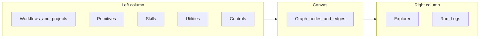

# Mind Weave

## What it is

Mind Weave is a full-stack web application for building and running **workflows** as **visual directed graphs** (DAGs). Each workflow is a named graph of **nodes** and **edges**: nodes are steps, and edges carry **data** and **execution ordering** between them. Workflows typically call a **local or self-hosted LLM** through an OpenAI-compatible API (for example LM Studio), so prompts and model calls stay under the operator’s control.

The application also stores reusable building blocks: **Personas** (named system prompts and optional default models), **Structures** (JSON schemas for structured LLM outputs), **Documents** (named persisted **body** text—Markdown, JSON, or other text the workflows interpret), and **palettes** that map step types to colors on the canvas. Users sign in; the browser talks to a backend that persists definitions, executes graphs, and integrates with the LLM and optional external services.

---

## Philosophy

**Explicit dataflow.** Inputs and outputs are wired visibly. **Optional forced outputs** let you inject a node’s result for a run (skipping that step) to explore downstream behavior without re-running expensive steps; overrides are session-only and validated on the server. Branching controls run only the **true** or **false** path that matches the current evaluation; boolean combinators (**And**, **Or**, **Xor**, **Not**) produce a single boolean for further wiring rather than splitting execution by themselves.

**Composable building blocks.** **Primitives** hold static or resource-backed values. **Skills** perform LLM calls or integrations. **Utilities** reshape data (lists, strings, dictionaries, integers, document fields, and basic HTML structure via **`html_parse_basic`**). **Controls** express conditions, comparisons, loops, and aggregation. **Workflow** nodes nest other saved workflows so large systems stay modular. Contributor-oriented framing (**utilities ≈ grammar**, **skills ≈ verbs**, placement exceptions): **[NODE_TAXONOMY.md](NODE_TAXONOMY.md)**.

**Local-first LLM usage.** The default mental model is a machine running an OpenAI-compatible server; the app does not assume a single vendor cloud. Integration skills (email and calendar) are optional layers on top of that core.

**Visual encoding.** Workflow palettes assign colors to step categories and specific step types so handles, edges, and node borders stay readable as graphs grow. Separately, **system theme** palettes control light and dark appearance of the overall UI.

---

## Application shell

The main layout uses a **sidebar** and a **content area**.

**Home** is the landing entry point.

Under **Build**:

- **Workflows** opens the **Workflow Editor** (the primary construction surface).
- **Workspace** opens a **Companion** chat: natural-language turns, staged runtime (interpretation, optional workflow-backed capabilities), and streaming replies. Details: [docs/WORKSPACE.md](WORKSPACE.md).
- **Replays** lists past **streamed** workflow runs for workflows the user owns. Each replay shows a read-only canvas aligned with the saved graph layout, plus recorded per-step inputs and outputs for inspection. Runs can be removed one at a time or in bulk (row checkboxes, **Cmd/Ctrl** + click to multi-select like **Manage Documents**, **All loaded** in the list header selects every run currently returned by the API—default **50** per request—then **Delete selected** with inline confirmation).
- **Sandbox** runs a **workflow-driven** grid simulation (server-owned ticks). The left **Workflows** list selects which definition drives the pet’s brain; you can **change workflows while the session is running**—the next tick that executes the graph uses the new definition, and the choice is **persisted** on the session (reload continues with the last selected brain). That makes it easy to compare policies side-by-side in one session. Caveats (intent continuation, incompatible graphs): [docs/SANDBOX.md](SANDBOX.md) (**Changing the brain workflow during a session**).

Under **Configure**:

- **Personas** — create, edit, and delete Personas used by LLM steps.
- **Structures** — manage JSON schemas for structured LLM outputs.
- **Documents** — manage persisted documents (**Raw** / **Preview** / **Metadata**); body text is flexible (Markdown is a common choice; JSON and other text are valid). The **Metadata** tab surfaces an estimated token count (against the GPT-4o family `o200k_base` tokenizer) plus character / word / line counts, document id, and timestamps.
- **Palettes** — **Editor** tab: workflow step colors; **System** tab: app-wide color theme tokens. Built-in presets exist for both; user-defined palettes can be created, edited, imported, and exported as JSON.
- **User Management** — available to administrators.

The header opens **My Settings** (profile, **appearance**—light, dark, or follow the device—default editor palette for new workflows, Google account linking where applicable, workflow time zone for time-based skills, API keys, avatar, and related options). Sessions for the bundled web app rely on **HttpOnly cookies** so the SPA does not store access tokens in browser storage.

---

## Workflows as graphs

Every workflow graph includes **Start** and **Stop** (plus the steps between them).

**Start** defines the workflow’s **inputs**. By default it has no required inputs; optional slots can be added with typed keys (`string`, `list`, `dictionary`, `boolean`, `int`). Each slot becomes an **output handle** for wiring. If there are no required inputs, a single `**output`** handle emits an empty string. Values can be set in the inspector or supplied at run time when still unset.

**Stop** defines what the workflow **returns**. It declares one **required output** (key and type). Downstream **Workflow** nodes that reference this definition expose matching output handles. **Stop** is terminal: it has **no** outgoing control signal.

**Workflow** nodes embed another saved workflow. Their input and output handles mirror the child workflow’s **Start** and **Stop** definitions. Cycles and self-reference are rejected at run time.

**Projects** organize workflow definitions into **folders**. Each user has a seeded **Shared** folder; additional projects can be created. Workflows can be **moved** between projects, **imported** as JSON into a project, or **exported** from the editor toolbar. List ordering can follow **last updated** or **name**, with optional **filtering** by name prefix.

**Execution safety** applies per run: optional saved **`execution_limits`** and optional per-run overrides (TTL, maximum step count, maximum list size for **For Loop** inputs, nested **Workflow** depth) merge under operator-configured ceilings; **`GET /api/v1/workflow-execution-limits/`** exposes those caps to the SPA. **Try / Catch** groups a **`try`** path and **`catch`** path with structured **`ok`** / **`error`** dictionaries; streamed runs can surface **`handled_by_try_catch`** when a failure is routed to **`catch`**. **For Loop** supports **sequential**, **parallel** (legacy **`parallel_iterations`**), or **batched** iteration with optional **`summary`** aggregation.

---

## Workflow Editor: layout

The editor is a three-column workspace: **left palettes**, **center canvas**, **right inspector**. A **toolbar** sits above the canvas for palette selection, saving, running, and export.

### Left column: Workflows

Opening **Workflows** shows **projects** first (including **Shared** and **New project**). Selecting a project drills into that folder: **Back**, **Import**, **New workflow**, a sort control (**Last updated** vs **Name**), a **Filter** on workflow names, **Move** per row, and the list of workflows in that project (definitions that are **not** exposed as custom skills; exposed ones are listed only under **Custom Skills**).

Dragging a workflow from the list or from **Custom Skills** onto the canvas adds a nested **workflow** step (`kind: workflow`) that references that definition. The canvas type badge reads **Workflow** for normal project-list drops and **Custom Skill** when the referenced definition has **Expose as Custom Skill** set. New nodes appear under the pointer at the current pan and zoom. Use **Explorer** (with no node or edge selected) and the caution **Expose as Custom Skill** button at the bottom of the panel to publish the current definition under **Custom Skills** (same graph shape as dragging from the project list). The workflow you are editing still appears there for confirmation, with **drag** disabled so you cannot nest it into itself.

The workflows **list** API does not return each definition’s **graph**; the editor **fetches the full workflow** for every nested `workflow_id` on the canvas (and merges it into local state) so **left-side data handles** on the nested step match the referenced workflow’s **Start** `required_inputs` (and right-side handles match its **Stop** outputs). Without that hydration, the nested node would only show a default single input.

### Left column: step palettes

**Primitives**, **Skills**, **Utilities**, **Controls**, and **Custom Skills** (when any eligible workflows exist) are separate collapsible sections. Each has a **Filter** field (case-insensitive prefix match on labels) and a scrollable list of tiles. Drag a tile onto the canvas to instantiate that step.

**Primitives:** String, List, Dictionary, Boolean, Int, Structure, Document.

**Skills:** Simple LLM Call (canvas default label often shortened to **LLM Call**), Gmail List Messages (**Gmail List**), Calendar List Events (**Calendar Events**), **Fetch URL** (HTTP from the API server; dictionary output, optional response cache).

**Utilities:** List to String, String to List, Prepend Text, String Trunc, Len from List, Int to String, List Item by Index, Dictionary Value by Key (optional fallback on missing or null value), Read Document Property, **Load Document**, **Upsert Document**, **Parse Document Body**, **Write Object to Document Body**, **Append Value to Document**, **Validate Against Structure**, **Add to List**, and integer math (**Add**, **Subtract**, **Multiply**, **Divide**, **Modulo**, **Min**, **Max**).

**Controls:** Basic Conditional (**Conditional** on canvas), **Is?**, **Gt?**, **Lt?**, **Gte?**, **Lte?**, **And**, **Or**, **Xor**, **Not**, **Between**, **For Loop**, **For Loop End**.

### Center: canvas

The canvas is an interactive graph. **Nodes** expose **handles** for inputs and outputs. **Edges** connect handles. **Workflow palettes** persist per-handle hex overrides (`colors` JSON); labels and taxonomy come from **`shared/workflow_graph_step_kinds.json`**, and **`GET`/create/update palette** responses expose derived **`effective_colors`** and **`warnings`** when keys are stale. **Which palette is active** is **`workflow.palette_id`** when set on the definition; otherwise the user’s **`preferred_editor_palette_id`** when that palette appears in **Configure → Palettes**; otherwise **Default** (slug **`default`** or equivalent). There is **no server “activate palette”** route—the editor resolves precedence locally. Rendering uses **`effective_colors`** from the loaded palette payload (explicit override → family fallback → shipped default **`any`**), so the SPA does not keep a handwritten mirror of every default hex map.

**Scroll wheel** zooms; panning repositions the view. Selecting a workflow in the list or opening a replay **fits the view** to the entire graph once nodes are measured (same as the **fit** action in the canvas bottom-right corner zoom controls).

While a run is in progress, the **currently executing** node is highlighted. The node or edge selected in the **Explorer** receives a separate **selection** highlight so it is easy to see what is being configured.

Most steps use **trigger** (in) and **signal_out** (out) to chain ordering. Branching controls add **true** and **false** (or equivalent) outputs so only the chosen branch’s downstream steps run.

### Toolbar

- **Palette** — choose which workflow color preset applies to the open workflow.
- **Save** — persist the graph. **Run** saves first, then executes.
- **Export** — download workflow JSON; **Copy** puts the same JSON on the clipboard for backups or sharing.

Saving updates the workflow’s **updated at** time so **Last updated** sorting reflects real edits.

### Right column: Explorer and Run Logs

**Explorer** is the inspector for whatever is selected:

- **Node** — labeled sections per step type (general label, prompts, Persona, Structure, integration options, etc.).
- **Edge** — connection metadata, source and destination summaries, and last-run payload hints with an optional full payload modal.

Sub-tabs or areas include **Last Run** (results for the selected node or edge from the most recent execution) and **Run Logs** (per-step history for the whole run).

**Last Run** and **Run Logs** show **Output** first, then **Inputs** for successful steps; for **failed** steps with **`resolved_inputs`**, **Inputs** appears **first** so troubleshooting sees wiring before the error output. When the backend provides **output explorer** metadata, **Output** appears as a structured card (summary, optional rows for lists or messages, **Preview** and **View raw** for full values). **Inputs** reuse the same card pattern per resolved input key, reflecting what the step actually consumed (including merged fields where applicable). Integration steps may also expose **skill diagnostics** for deeper API-level inspection during or shortly after a run; persisted logs redact sensitive fields.

### Running a workflow

**Run** saves, then starts execution (typically streamed to the UI). If **Start** still has required inputs that are **unset** (distinct from empty string or explicit `[]` / `{}` where those count as real values), a **stepped dialog** collects one value per missing slot in order before execution. **Continue** advances; **Run** on the final step starts the workflow; **Back** revisits a prior step; **Cancel** closes without running.

For **list** and **dictionary** fields on primitives, **Start** slots, or the pre-run wizard, **Normalize JSON** is an explicit action that strips common noise (such as markdown fences) and extracts balanced JSON—nothing is rewritten automatically while typing.

### Replays

**Build → Replays** opens a full-width modal: a list of past runs, then a read-only graph and an explorer-style view of recorded inputs and outputs per step (node and edge colors still follow the workflow’s palette). This uses the **current** saved graph for layout; it helps compare what happened in an old run against today’s definition. This is valuble for both performing diagnostics on, but also re-visiting the results of, previous runs for troubleshooting or helpful artifacts.

The run list supports **multi-select** (checkboxes; **Cmd** / **Ctrl** + click on a row toggles membership, same pattern as **Configure → Documents**), an **All loaded** control in the header to select every run in the current list, and **Delete selected** with a second-step **Delete all** / **Cancel** confirmation. The app issues one **DELETE** per run; clearing many runs at once is a client-side loop, not a single batch API.

---

## Execution behavior (conceptual)

The backend validates the graph (including cycle detection), derives an execution order, and runs steps in **waves**: steps whose dependencies are satisfied can run together. **Sibling** branches from the same parent can execute **in parallel** (for example multiple LLM calls).

**Branching** controls only **activate** downstream nodes on the branch that matches the result. **And**, **Or**, **Xor**, and **Not** output a single boolean for downstream use; they do not split execution into two paths.

**For Loop** iterates over a **list** input. The **body** runs once per item. **List** primitives inside the body do not accumulate across iterations by themselves; **Add to List** is the utility used to **append** to a list across iterations when aggregation is needed. **For Loop End** pairs with a **For Loop** by wiring **`signal_out` → `trigger`** (the editor stores the For Loop’s node id automatically); **Explorer → General** shows each step’s **Node id** for reference. It receives the For Loop’s **signal** after the body completes and collects **named** exports from body nodes into a **dictionary** output according to inspector configuration and wiring. **For Loop End** is **not** part of the per-iteration body—it runs once on the main schedule after the loop finishes.

**Dictionary** primitives can **merge** multiple incoming data edges in edge order (shallow merge for dictionary outputs; other wired values keyed by source handle where applicable).

**Simple LLM Call** requires a **Persona**. Optional **additional context** can be inlined or wired; the **user** message comes from the **User Prompt** path. If a **Structure** is attached (selector or wired), the model is asked for **structured JSON** matching that schema; otherwise the result is treated as free text.

**Gmail** and **Calendar** list skills use linked Google accounts and profile **workflow time zone** settings where dates and times are interpreted in the UI; raw search and API behavior follow each provider’s rules.

---

## Node families in practice

Conceptual taxonomy (Skills vs Utilities, placement guide, persisted **Document** utilities as an intentional exception): **[NODE_TAXONOMY.md](NODE_TAXONOMY.md)**. The collapsible palettes in **Build → Workflows editor** (**Primitives**, **Skills**, **Utilities**, **Controls**) are always the authoritative step list; below is a short field guide.

### Primitives

Static or resource-backed values: text, JSON **list** / **dictionary**, booleans, integers, datetimes, **Structure**, **Document**, **Image**, **Gmail-shaped** payloads, sandbox-focused shapes where applicable (`shared/workflow_graph_step_kinds.json` + editor palettes stay exact). Stored **Document** bodies use the historical wire field **`markdown`**; authoring often happens in Markdown under **Configure → Documents**.

### Skills

Representative integrations: **Simple LLM Call**, **Multimodal LLM**, **Fetch URL**, **URL snapshot**, speech / TTS / transcription paths, Gmail and Calendar listings, optional provider-abstracted STT—all require correct local or cloud prerequisites (see **[WORKFLOW_TOOL_INVENTORY.md](WORKFLOW_TOOL_INVENTORY.md)**, **[WORKFLOW_SKILLS.md](WORKFLOW_SKILLS.md)**, **[OUTPUT_EXPLORER_UI.md](OUTPUT_EXPLORER_UI.md)**).

### Utilities

Transforms and validations: lists/strings/dictionaries/int math, **Read Document Property**, **Load / Upsert Document** (**first-party persisted resources**, still modeled as utilities—see taxonomy doc), HTML parse (**`html_parse_basic`**), JSON helpers (**Parse / Write / Append**), **Validate Against Structure**, **Add to List**.

### Controls

Branching (**Basic Conditional**, **Is?**, **Is Empty?**, ordered comparisons, **Between**), boolean combinators (**And**, **Or**, **Xor**, **Not**), **Try / Catch**, **For Loop** / **For Loop End**.

### Start, Stop, Workflow

**Start** supplies inputs; **Stop** defines outputs. **Workflow** nodes embed referenced definitions (**Custom Skill** UX when exposed); see palette sections above for drag/drop mechanics.

---

## Palettes and themes

**Workflow palettes** affect only the **editor canvas**: how types read visually. **System palettes** affect **chrome** (sidebar, cards, buttons, text colors) in light and dark mode. Users can pick a system theme preset, optionally export or import theme JSON, and override fine-grained colors in settings where supported. New workflows can inherit a **preferred editor palette** from settings when one is configured.

---

## Summary

Mind Weave combines **reusable prompts and schemas**, **visual DAG editing**, **local LLM execution**, and optional **integrations**, with a consistent editor experience: drag steps from palettes, wire data and control flow, run with clear pre-flight input collection, and inspect results through structured **Output** and **Inputs** views, **run logs**, and **replays**.