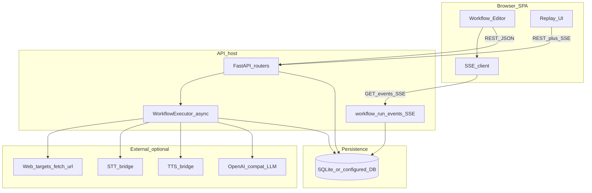
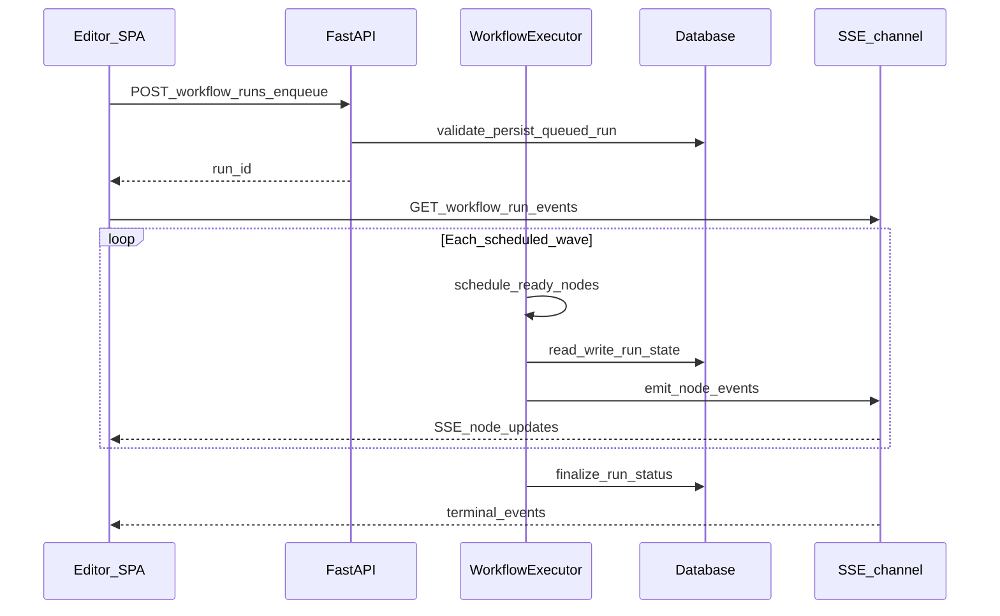

# Mind Weave — runtime and system architecture

**Onboarding path:** New readers should start with the root **[README.md](../README.md)** (capabilities, mental model, quick launch), then **[DOMAIN_MODEL.md](DOMAIN_MODEL.md)** for terminology before this runtime map.

This document is the **high-level runtime map**: how the browser, API, workflow executor, streams, and persistence fit together. For **layering, single sources of truth, and implementation detail**, see [ARCHITECTURE.md](ARCHITECTURE.md). For **what each node family means** (skills vs utilities vs controls), see [NODE_TAXONOMY.md](NODE_TAXONOMY.md).

## High-level runtime overview

Mind Weave ships as a **React + Vite** single-page app that talks to a **FastAPI** backend over **HTTPS (or HTTP in dev)**. The backend **persists** workflow definitions, user resources, and run history (default **SQLite**), **validates** graphs, and runs workflows in a **background async execution** path. **Build** runs from the editor use **Server-Sent Events (SSE)** so node state streams to the UI while steps execute. **Local LLM** traffic uses an **OpenAI-compatible** HTTP API (for example **LM Studio** on the operator’s network). Optional **TTS** and **STT** are separate **HTTP bridge** processes the API calls when workflow skills need them.

## System components

### Frontend (SPA)

- **Workflow editor** — Visual DAG on React Flow: palette, canvas, inspector, save/load, export/import.
- **Graph rendering** — Nodes, edges, palette colors resolved via the API (**`GET /api/v1/palettes/resolve`**).
- **SSE subscriptions** — **`GET /api/v1/workflow-runs/{run_id}/events`** for live Build runs; reconnect/replay of persisted events.
- **Replay / explorer UI** — Read-only graph + per-step logs for completed runs (**Build → Replays**).
- **Other surfaces** — Workspace (companion chat), Sandbox (tick simulation with ephemeral nested workflow run logs on each tick — not persisted `workflow_runs`), configure modals (Personas, Documents, Palettes, …), per [MIND_WEAVE_ONE_PAGE.md](MIND_WEAVE_ONE_PAGE.md).

### Backend API layer

- **FastAPI** — REST routers under `app/api/v1/`: auth, workflow definitions, runs, resources, settings.
- **Auth / sessions** — Cookie-based JWT for the bundled SPA; optional `Authorization: Bearer` for API clients.
- **Persistence orchestration** — Services + SQLModel tables: definitions, runs, node logs, documents, palettes, etc.
- **Validation** — Graph shape, execution limits, preflight step budgets before run enqueue.

### Workflow execution runtime

- **DAG execution** — Topological scheduling with **dependency waves** (steps ready when inputs and control flow allow).
- **Async orchestration** — `asyncio` with guarded parallelism: **concurrency buckets** (LLM, browser, TTS, external skills) and per-user **LM Studio wave caps** cooperate with **`WORKFLOW_MAX_CONCURRENT_*`** semaphores.
- **Branching and loops** — Conditionals route **true** / **false** edges; **For Loop** schedules body iterations; **Try / Catch** isolates failure regions.
- **Streaming** — Executor publishes ordered lifecycle events (**`node.completed`**, **`node.failed`**, **`input_required`**, …) consumed by the SSE route; run and **`NodeRunLog`** rows persist outcomes for replay.

### AI and integration layer

- **Local / OpenAI-compatible LLMs** — Chat and model listing against **`LMSTUDIO_BASE_URL`** (and related env); workflow **Simple LLM Call** / **Multimodal LLM** nodes.
- **Optional bridges** — **TTS** and **STT** HTTP services (`services/tts-bridge`, `services/stt-bridge`) for speech skills.
- **Other skills** — **`fetch_url`**, **`capture_url_snapshot`** (Playwright in the API process when installed), Gmail/Calendar integrations, transcription providers, etc. Inventory: [WORKFLOW_TOOL_INVENTORY.md](WORKFLOW_TOOL_INVENTORY.md), [WORKFLOW_SKILLS.md](WORKFLOW_SKILLS.md).

### Persistence and state layer

- **Workflow definitions** — Stored DAG JSON (`nodes`, `edges`, optional **`execution_limits`**), projects, versioning metadata.
- **Workflow runs** — **Build** **`POST …/runs`** creates **`WorkflowRun`** rows; **`NodeRunLog`** stores per-step results (redaction rules apply to sensitive fields).
- **Replay history** — Clients reattach to **`…/events`** or open Replays using persisted logs + current graph layout.
- **User settings and palettes** — **`User.settings`** (including preferred editor palette); server-authoritative **palette resolve** merges workflow selection, user preference, and defaults.
- **Resources** — Personas, Structures, Documents, voice samples, optional workspace/companion tables — see [ARCHITECTURE.md](ARCHITECTURE.md) for SSOT pointers.

## Component diagram

## Execution flow from Run to replay

When you **Run** a workflow from the editor (**Build**), the following is the conceptual pipeline. Exact route names and payloads are in the API and [ARCHITECTURE.md](ARCHITECTURE.md).

1. **Client submits** a workflow execution request (**`POST /api/v1/workflow-definitions/{id}/runs`**) with optional overrides and limits.
2. **Backend validates** the graph, merges **execution limits**, runs **preflight** budgeting when applicable, and enqueues a **WorkflowRun** row.
3. **Executor** builds the runnable DAG, resolves **dependency waves**, and schedules ready nodes.
4. **Async tasks** run with concurrency caps: parallel steps where safe, serialized DB-critical sections where required.
5. **SSE** broadcasts **node state** and lifecycle events to connected clients on **`GET /api/v1/workflow-runs/{run_id}/events`**.
6. **Frontend** updates the canvas and explorer from the stream (and from local UI state).
7. **Results** persist to **run** and **node log** tables for **Replays** and debugging.

## Non-goals for this document

- **Palette hex maps**, manifest keys, or step-kind tables — see [ARCHITECTURE.md](ARCHITECTURE.md) and [`shared/workflow_graph_step_kinds.json`](../shared/workflow_graph_step_kinds.json).
- **Per-skill HTTP contracts** — see [WORKFLOW_SKILLS.md](WORKFLOW_SKILLS.md).
- **Contributor checklists for new nodes** — see [NODE_TAXONOMY.md](NODE_TAXONOMY.md) and [ARCHITECTURE.md](ARCHITECTURE.md) (**Adding a workflow node type**).
